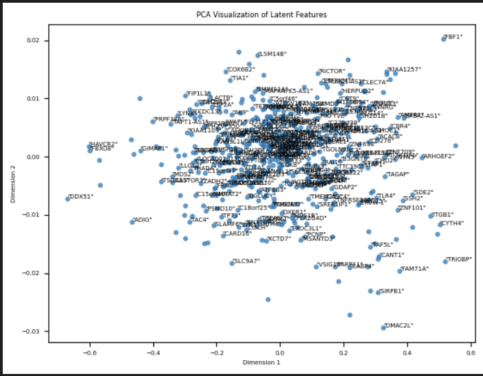

# Gene Expression Analysis: Auto-Encoders

_This is an exploration into how genes are related to one another via autoencoders!_

## How to Run

Data is taken from [ADeX](https://adex.genyo.es/) (`Download Data -> (Select Datasets) -> Prepare Data`, then unzip all the files it gives you and place the `*.tsv` in `data`!); it takes in data from the `data` folder in the following format:

```
"gene"	"GSM1100843"	"GSM1100844"	"GSM1100845"	"GSM1100846"
"DDR1"	"5.58183689567811"	"5.46663940292863"	"5.59426975337949"	"5.76113110310609"
"RFC2"  "5.74483915124396"	"4.87059905993801"	"5.12428761586708"	"5.01206397654543"
```

In which the first column contains the sample names (`GSM1100843`, `GSM1100844`, etc.), and each column contains that sample's differential expression for the particular gene corresponding to that row (ex. `DDR1`, or `RFC2`).

Some sample data is supplied in `data_small`, and can be moved to the `data` folder to be run on; however, the data given is relatively small and difficult to run a model on (AKA it will likely overfit.)

## Implications and Results

The model can achieve an accuracy of around 25% on the `GSE45291_RA` dataset; while achieving accuracies of 95+% on the `data_small` files, I suspect it was likely overfitting (especially when looking at the latent feature dimensionality reduction). While not amazing, it's nonetheless interesting that it is able to go from a gene expression profile of `513` genes, reduce it down to a vector of `7` genes, and reconstruct it with relatively high accuracy considering the difficulty of the task at hand.

## Some figures:


_Figure 1: PCA being performed on latent features the model found on the data trained; some clustering appears to be occurring, but there doesn't appear to be any clear distinction between patients with and without RA._




_Figure 2: PCA being performed on latent features where the gene labeled is synthetically upregulated, and everything else is 0. The first figure was the model suspected to be overfitting, but there appear to be some interesting clusters. Also apologies about the quality!_